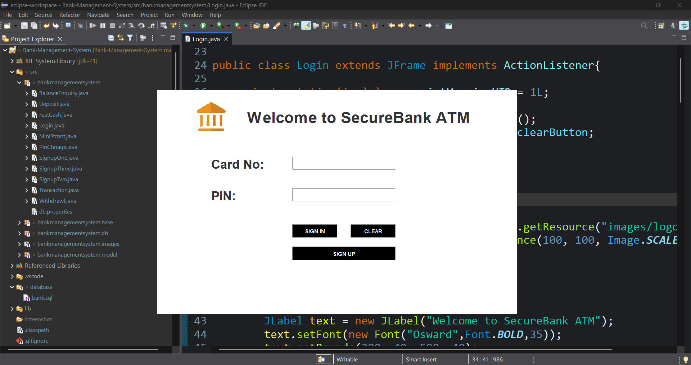
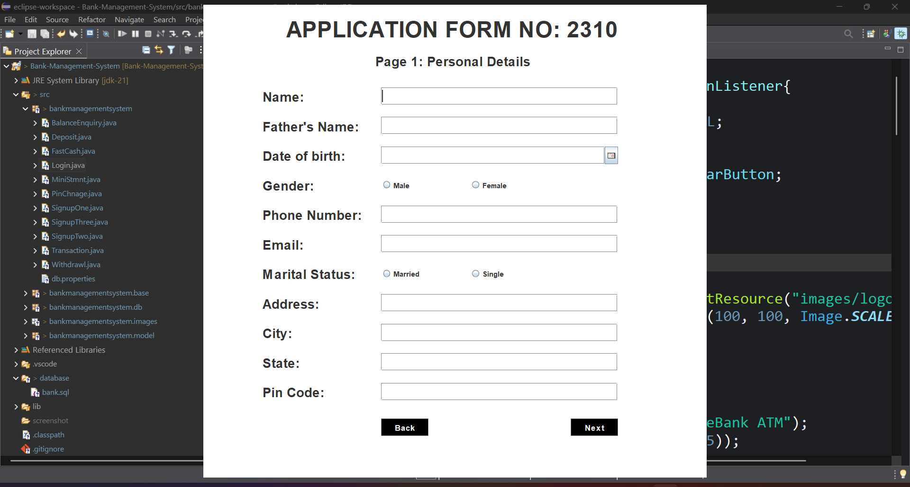
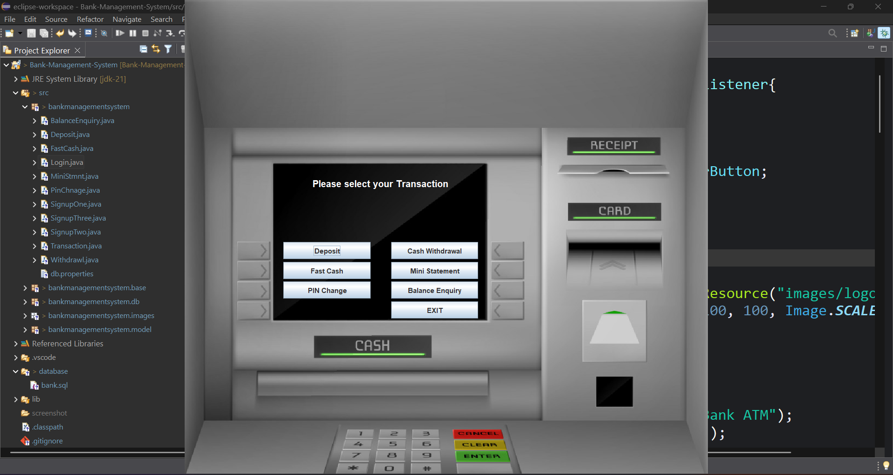

# 🏦 Bank Management System - Java Desktop Application

A desktop-based **Bank Management & ATM Simulation System** developed using **Java (Swing + AWT)** and **MySQL**.  
This project simulates real-world banking operations including **account creation, authentication, and ATM transactions**, following a structured multi-step workflow and clean **object-oriented architecture**.

---

## 🎯 Objective

The objective of this project is to design a complete banking application that demonstrates:

- Multi-step user registration system  
- Secure login using Card Number & PIN  
- Real-time transaction handling  
- Database connectivity using JDBC  
- Transaction consistency using commit & rollback  
- Modular and scalable application design  

---

## 🛠 Technologies Used

- **Language:** Java  
- **UI Framework:** Java Swing + AWT  
- **Database:** MySQL  
- **Connectivity:** JDBC (PreparedStatement)  
- **Architecture:** Object-Oriented Programming (OOP)  
- **IDE:** Eclipse  

---

## 🧾 Account Registration System

The application implements a **three-step banking registration workflow**:

- **Signup Page 1:** Personal Details  
- **Signup Page 2:** Additional Information  
- **Signup Page 3:** Account Setup & Banking Facilities  

The system automatically generates a **Card Number** and **Secure PIN**, while maintaining data consistency across pages using a centralized `SignupData` model.

---

## 🔐 Login System

Users can log in using:

- **Card Number**
- **PIN Number**

Authentication is validated directly from the database, simulating ATM login behavior.

---

## 💳 ATM Features

After successful login, users can perform:

- Deposit Money  
- Withdraw Money  
- Fast Cash Withdrawal  
- Balance Enquiry  
- Mini Statement  
- PIN Change  

Each transaction is stored in the **transactions table**, maintaining complete account history.

---

## 🗄 Database Management

The application uses **MySQL** with **JDBC PreparedStatement**
to securely manage banking data and prevent SQL injection.

The database structure is designed to maintain user information
and transaction records across multiple modules.

### Database Tables

- **signupone, signuptwo, signupthree**  
  Store complete customer registration details collected during the multi-step signup process.

- **atmlogin**  
  Stores Card Number and PIN used for secure ATM authentication.

- **transactions**  
  Maintains deposit, withdrawal, and account activity history.

Transaction consistency is ensured using **commit and rollback**
mechanisms during database operations.
  
---

## ⚙ System Features

- Multi-page form navigation with data persistence  
- Smooth UI transitions with animations  
- Random Card & PIN generation  
- JDBC transaction handling  
- Thread-based database execution  
- Clean separation of UI and data logic  

---

## 🧠 Key Concepts Implemented

- Object-Oriented Design  
- Event-Driven Programming  
- JDBC Database Integration  
- Exception Handling & Rollback  
- Stateful Multi-Form Navigation  

---

## 📸 Application Screenshots

### Login Page



### Signup Screen


*The registration process consists of multiple signup pages following a similar interface and workflow.*

### ATM Dashboard / Transactions



---

## 🚀 How to Run the Project

Follow the steps below to run the Bank Management System on your local machine.

---

### ✅ Prerequisites

Make sure the following software is installed:

- Java JDK 8 or above
- MySQL Server
- Eclipse IDE (or any Java IDE)
- MySQL JDBC Driver

---

### 📥 Step 1: Clone the Repository

```bash
git clone https://github.com/your-username/Bank-Management-System.git
```

---

### 📂 Step 2: Import Project into Eclipse

1. Open Eclipse IDE  
2. Click on **File → Import**  
3. Select **Existing Projects into Workspace**  
4. Choose the cloned project folder  
5. Click **Finish**

---

### 🗄 Step 3: Setup MySQL Database

Import the provided SQL script to automatically create the
database and required tables.

- Open **MySQL Workbench**
- Click **File → Open SQL Script**
- Select:

```text
database/bank.sql
```

- Click **Execute (⚡)** to run the script

---

### ⚙ Step 4: Configure Database Connection

Open `Conn.java` and update database credentials:

```java
String url = "jdbc:mysql://localhost:3306/bankmanagementsystem";
String user = "root";
String password = "your_password";
```

---

### 🔌 Step 5: Add MySQL JDBC Driver

- Right click on project  
- Build Path → Configure Build Path  
- Libraries → Add External JARs  
- Select `mysql-connector-java.jar`

---

### ▶ Step 6: Run the Application

Run the main class:

`Login.java`

The application will start with the ATM Login Screen.

---

### ✅ Testing Flow

1. Create Account using Signup pages  
2. Generate Card Number & PIN  
3. Login using generated credentials  
4. Perform ATM transactions